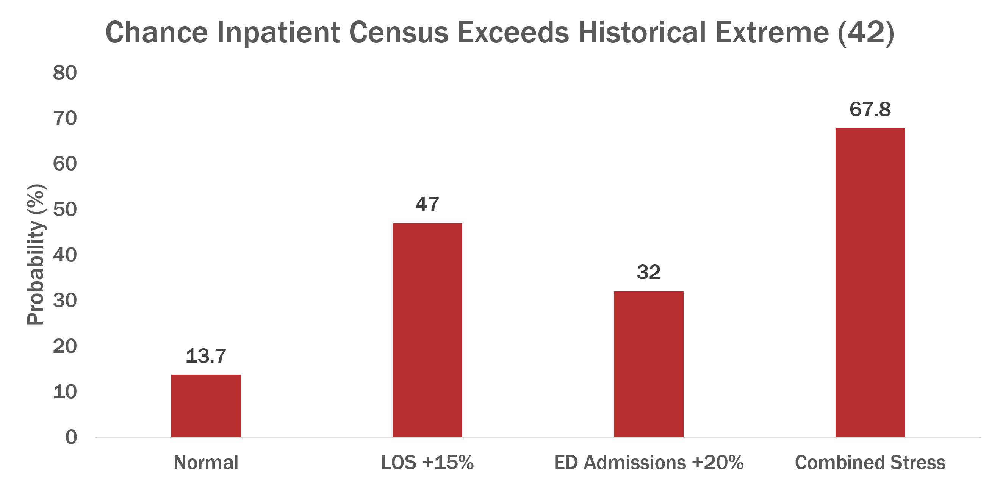
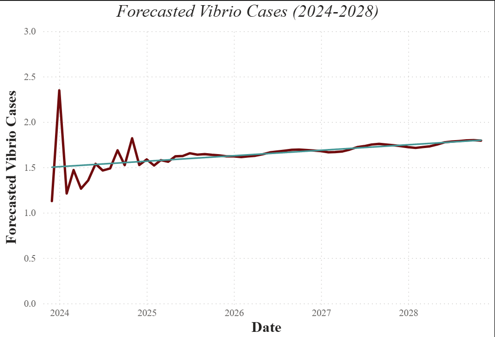

## Data Science | Computational Biology | Life Sciences

I like solving problems that matter, and biology happens to be full of them. From viruses and immune systems to evolution, conservation, and animal health, I’m fascinated by how small biological changes can create much bigger effects. A gene changes, a pathogen enters the picture, a pathway shifts—and suddenly the behavior of a cell, organ, organism, or population can look completely different. I use systems modeling, machine learning, genomics, and data analysis to follow those connections and figure out what the data is actually telling us.

::: {.hero-actions}

[Download Resume](files/Ankur-Bambhrolia-Resume.pdf){.btn .btn-primary}

[Email Me](mailto:abambhrolia@gmail.come){.btn .btn-outline-primary}

:::

---

## Featured Projects

:::: {.featured-grid}

::: {.featured-card}

### Surgical Ramp-Up Capacity Simulation

{.featured-image fig-alt="Probability that inpatient census exceeds the historical extreme of 42 under normal and stressed operating conditions"}

How much additional elective surgical volume can a hospital safely absorb without creating unacceptable pressure on PACU and inpatient capacity?

[Simulation]{.tag} [Monte Carlo]{.tag} [Healthcare Analytics]{.tag} [Python]{.tag} [BigQuery]{.tag}

[Explore Project →](projects/surgical-ramp-up.qmd)

:::

::: {.featured-card}

### *Vibrio vulnificus* Risk Analysis

{.featured-image fig-alt="Forecasted Vibrio vulnificus isolates from 2024 to 2028"}

How do changing environmental conditions influence the risk and geographic spread of *Vibrio vulnificus* along the U.S. coastline?

[Infectious Disease]{.tag} [Geospatial Analysis]{.tag} [Forecasting]{.tag} [Python]{.tag} [Power BI]{.tag}

[Explore Project →](projects/vibrio.qmd)

:::

::::

---

## Explore My Work

Pick a path and dive in!

:::: {.path-grid}

::: {.path-card}

### Omics & Bioinformatics

Explore biological questions through genomic, transcriptomic, metagenomic, and other omics data.

[Explore →](omics.qmd)

:::

::: {.path-card}

### Computational Biology

Explore biological systems through mathematical modeling, simulation, dynamics, and quantitative methods.

[Explore →](computational-biology.qmd)

:::

::: {.path-card}

### Applied Data Science

Explore how I use statistics, simulation, machine learning, and data analysis to solve real-world problems.

[Explore →](applied-data-science.qmd)

:::

::::

