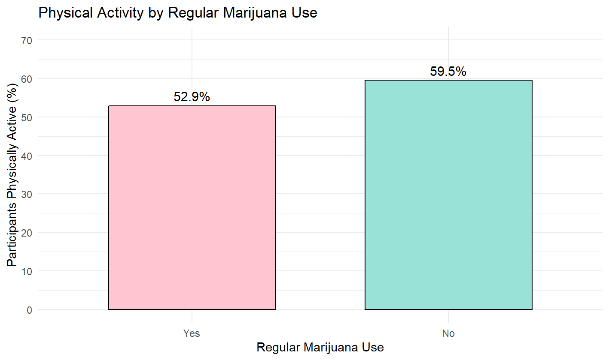
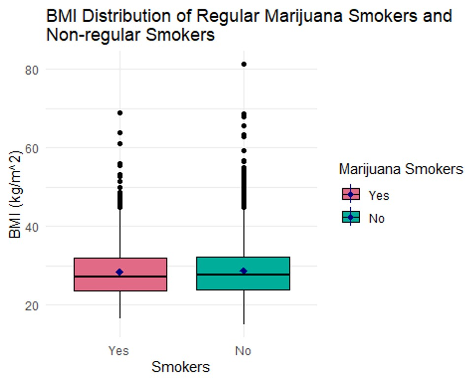

An R-based population-health analysis examining how regular marijuana use is associated with physical activity, BMI, and heart rate using NHANES data.

## Question

**Are regular marijuana users more sedentary than non-regular users based on physical activity, BMI, and heart rate?**

The analysis tested three related questions: whether regular marijuana use was associated with physical-activity status, whether average BMI differed between regular and non-regular users, and whether average heart rate differed between the two groups.

## Why It Matters

A sedentary lifestyle can be difficult to capture with a single measurement. Physical activity, BMI, and heart rate each describe a different piece of the picture, making it useful to examine them together rather than relying on one health indicator alone.

This project used regular marijuana use as the behavioral exposure and asked whether users showed measurable differences in those indicators compared with people who did not regularly use marijuana.

The larger statistical question was also important: **does finding a statistically significant difference necessarily mean that the difference is large enough to matter biologically or practically?** The results provided a useful example of why those are not always the same thing.

## Data

The analysis used **2009–2012 National Health and Nutrition Examination Survey (NHANES)** data. The original dataset contained approximately 10,000 participants and 76 variables.

Participants with missing regular-marijuana-use responses were removed, leaving a study population of **4,941 adults ages 18–59**.

The analysis focused on four variables:

- **Regular marijuana use** — whether a participant reported regularly using marijuana, defined in the project as at least once per month over the course of a year;
- **Physical activity** — whether the participant reported engaging in moderate- or vigorous-intensity sports, fitness, or recreational activity;
- **BMI** — body mass index measured in kg/m²;
- **heart rate** — heart rate measured in beats per minute.

Additional missing values were handled separately for each outcome, leaving **4,915 participants for the BMI analysis** and **4,863 for the heart rate analysis**.
## Methods

The analysis followed three main stages:

1. **Data preparation in R**  
   Participant-level NHANES files were cleaned and combined into an analysis-ready dataset centered on marijuana-use status, BMI, and sex.

2. **Exploratory analysis and assumption checking**  
   Histograms and box plots were used to examine BMI distributions and compare groups, while Q-Q plots helped evaluate whether the data were reasonably consistent with assumptions required for parametric testing.

3. **Statistical comparison of groups**  
   T-tests and confidence intervals were applied to determine whether observed differences in BMI between groups were larger than would reasonably be expected from sampling variation alone.

The full workflow was documented in **RMarkdown**, keeping the statistical analysis, visualizations, and interpretation together in a reproducible report.

## Results

The analysis produced a somewhat unexpected pattern: regular marijuana users were less likely to report being physically active, but their average BMI and heart rate were slightly lower than those of non-regular users.

### Physical Activity

Among regular marijuana users, **52.9% reported being physically active**, compared with approximately **59.5% of non-regular users**.

{fig-alt="Percentage of participants reporting physical activity among regular and non-regular marijuana users. Regular users reported lower physical activity than non-regular users."}

Regular marijuana users reported physical activity about **6.6 percentage points less often** than non-regular users.

A chi-squared test found a statistically significant association between regular marijuana use and physical-activity status:

- **χ² = 17.35**
- **p = 3.11 × 10⁻⁵**

Regular marijuana users appeared less often than expected in the physically active group and more often than expected in the not-physically-active group.

### BMI

After removing participants with missing BMI measurements, the BMI analysis included **4,915 participants**.

| Group | Mean BMI | Median BMI |
|---|---:|---:|
| Regular marijuana users | **28.34** | **27.1** |
| Non-regular users | **28.78** | **27.6** |

{width="80%" fig-alt="BMI distributions for regular and non-regular marijuana users, showing similar centers and numerous upper outliers."}
The two groups had very similar BMI distributions, with substantial overlap and only a small difference in their centers.

A Welch two-sample t-test identified a small difference in mean BMI:

- **Mean difference: -0.44 kg/m²**
- **95% CI: -0.86 to -0.02 kg/m²**
- **p = 0.0418**

Because BMI was right-skewed and contained numerous outliers, I also used a Wilcoxon rank-sum test. That comparison produced a similarly small estimated location shift of approximately **-0.39 kg/m²** with **p = 0.0495**.

Although both tests were near or below the conventional 0.05 significance threshold, the magnitude of the BMI difference was very small.

### Heart Rate

The NHANES **Pulse** variable, which measures heart rate in beats per minute (BPM), was available for **4,863 participants** after missing observations were removed.

| Group | Mean Heart Rate |
|---|---:|
| Regular marijuana users | **72.59 BPM** |
| Non-regular users | **73.53 BPM** |

A Welch two-sample t-test found:

- **Mean difference: -0.94 BPM**
- **95% CI: -1.69 to -0.20 BPM**
- **p = 0.0131**

The difference was statistically significant, but less than one beat per minute on average, making its practical or biological importance limited.

Overall, the strongest finding was the association between **regular marijuana use and lower reported physical activity**. Differences in BMI and heart rate reached statistical significance but were small enough that statistical significance should not be confused with meaningful differences in health.

## Interpretation

The results tell two different stories depending on whether the focus is **statistical significance** or **practical significance**.

The clearest pattern appeared in physical activity. Regular marijuana use was significantly associated with physical-activity status, with regular users reporting physical activity less often than non-regular users. This supports the idea that the two variables are related within the NHANES sample, although the observational design cannot establish that marijuana use caused the difference in activity.

BMI and heart rate produced a different result. Both comparisons reached conventional statistical significance, but the actual differences between groups were very small. Regular marijuana users had an average BMI about **0.44 kg/m² lower** and an average heart rate about **0.94 BPM lower** than non-regular users.

Those differences are statistically detectable in a sample of this size, but they are not necessarily large enough to represent meaningful differences in health. In other words, a small p-value answers the question **“Is there evidence of a difference?”**; it does not answer **“Is that difference important?”**

The BMI analysis also illustrates why the distribution of the data matters. Because BMI was right-skewed and contained numerous outliers, the Wilcoxon rank-sum test provided a useful comparison alongside the t-test. Both approaches pointed toward only a small difference between the groups.

Taken together, the analysis suggests that regular marijuana use was associated with lower reported physical activity, while differences in BMI and heart rate were statistically detectable but practically small.

## Limitations

Several limitations affect how strongly these results should be interpreted.

- **The analysis is observational.** The study can identify associations between regular marijuana use and physical activity, BMI, or heart rate, but it cannot establish that marijuana use caused any of the observed differences.

- **The timing of marijuana use and physical-activity behavior was unknown.** The data do not show whether participants became regular marijuana users before or after becoming more or less physically active, making the direction of the relationship unclear.

- **Physical activity was represented as a binary measure.** Participants were classified according to whether they engaged in moderate- or vigorous-intensity recreational activity, but the analysis did not measure frequency, duration, or intensity in greater detail.

- **BMI and heart rate provide only a limited picture of health.** Although both were useful measurable outcomes, neither captures the full biological or behavioral consequences of a sedentary lifestyle.

- **The analysis did not account for other factors that could differ between marijuana-use groups.** Variables such as age, diet, tobacco or alcohol use, underlying health conditions, and other lifestyle characteristics could contribute to differences in BMI, heart rate, or physical activity.

- **The BMI result was borderline depending on the statistical approach.** The Wilcoxon rank-sum test produced a p-value of approximately **0.0495**, placing the result very close to the conventional 0.05 threshold. Combined with the very small estimated difference, this makes the practical interpretation more important than simply classifying the test as significant or not significant.

For those reasons, the findings are best interpreted as **population-level associations within this NHANES sample rather than evidence that regular marijuana use directly produces a more sedentary lifestyle**.

## Next Steps

The analysis could be extended in several ways to better understand the relationship between regular marijuana use and sedentary behavior.

- **Examine the timing of marijuana use and physical activity.** The current study cannot determine whether participants became regular marijuana users before or after changes in their activity level. Establishing that sequence would help clarify the direction of the relationship.

- **Measure physical activity in greater detail.** Rather than treating activity as a yes/no variable, future work could examine how often participants exercise and how much time they spend being physically active.

- **Expand the set of health indicators.** Additional measures such as blood pressure, stroke history, and other health outcomes could provide a broader picture of whether regular marijuana users differ from non-regular users in ways associated with a sedentary lifestyle.

- **Include additional behavioral measures.** Variables such as time spent indoors versus outdoors could help characterize lifestyle differences that are not captured by BMI, heart rate, or a binary physical-activity measure.

The larger goal would be to move beyond asking whether the two groups differ and toward understanding **how regular marijuana use, activity patterns, and health characteristics relate to one another over time**.

## Repository

The full project repository includes the NHANES variable documentation, final statistical analysis, visualizations, and the R/Quarto source used to produce the report.

[View the NHANES Dataset Analysis repository →](https://github.com/AnkurBambhrolia/NHANES-Dataset-Analysis)