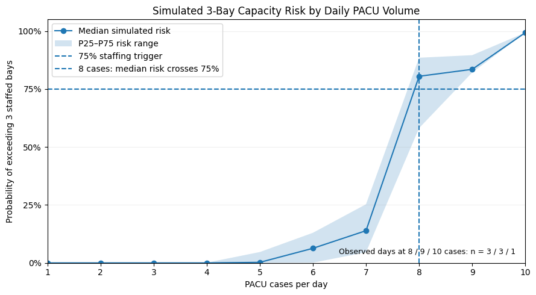

A Monte Carlo simulation designed to estimate when a short-staffed PACU is likely to exceed capacity and when temporary staffing should be activated.

## Question

**When PACU staffing is reduced to three staffed bays, how can the surgical schedule be used to estimate whether temporary staffing should be activated before capacity problems occur?**

Case count alone cannot fully answer that question. Two schedules with the same number of procedures can create very different PACU demand depending on **when patients arrive and how long they remain in recovery**.

The project therefore asked whether historical recovery-time patterns and scheduled PACU arrivals could be combined in a simulation to estimate the probability of exceeding staffed capacity before the day begins.

## Why It Matters

PACU capacity problems are difficult to manage reactively. Once recovery demand exceeds staffed capacity, the system is already under pressure.

A simple case count can provide an early warning, but it does not capture how cases overlap. A schedule with several closely clustered arrivals and long recovery times can create much more pressure than another schedule with the same number of procedures spread across the day.

That makes the staffing decision fundamentally a **risk-estimation problem**. Rather than asking only how many cases are scheduled, the analysis estimates how likely the schedule is to exceed available staffed capacity and uses that probability to support a proactive staffing decision.

The goal is not to predict the exact number of PACU patients at every moment, but to give leaders enough information to decide whether additional staffing should be activated before the day begins.

## Data

The analysis used a **synthetic healthcare operations dataset** accessed through Google BigQuery. The primary source was the `or_encounter` table, which contained surgical-case and PACU timing information.

Key fields included:

- **`or_case_id`** — unique surgical case identifier;
- **`or_pacu_arrival_dttm`** — timestamp for PACU arrival;
- **`or_pacu_discharge_dttm`** — timestamp for PACU discharge; and
- **`or_case_type`** — surgical case classification.

PACU length of stay was calculated from the arrival and discharge timestamps. Across the historical data, the **median PACU stay was 97.0 minutes** and the **90th percentile was 171.7 minutes**.

Daily PACU volume was also reconstructed to identify schedules that could place greater pressure on capacity. The highest-volume observed day contained **10 PACU arrivals**, compared with a historical median of **3 arrivals per day**.

That 10-case day was retained as the primary stress-test schedule, including its actual PACU arrival times. The simulation then varied patient recovery duration while keeping the schedule itself fixed.

## Methods

The simulation followed four main stages:

1. **Reconstruct historical PACU demand**  
   PACU length of stay was calculated from recorded arrival and discharge timestamps to establish the historical recovery-time distribution.

2. **Fix the scheduled arrival pattern**  
   The 10-arrival high-volume day was used as the primary stress-test schedule. Its observed PACU arrival times were held constant so the analysis could isolate uncertainty in recovery duration.

3. **Simulate recovery-time uncertainty**  
   For each Monte Carlo iteration, PACU length of stay was resampled from the historical distribution. The sampled recovery times were added to the fixed arrival times to generate simulated discharge times.

4. **Reconstruct occupancy and measure capacity risk**  
   Concurrent PACU occupancy was recalculated across each simulated day. The simulation recorded:
   - peak PACU demand;
   - whether demand exceeded the **3 staffed bays**;
   - time spent above staffed capacity; and
   - excess patient-minutes created while demand exceeded capacity.

Repeating this process generated a distribution of possible outcomes for the same surgical schedule rather than relying on a single deterministic estimate.

Case volume was also evaluated as an **early screening tool**. Schedules with **7 PACU cases** were flagged for review of arrival clustering, while schedules with **8 or more cases** were treated as high-risk candidates for simulation.

The final staffing decision was based on the **schedule-specific simulated probability of exceeding three staffed bays**, with a proposed activation threshold of **75% risk**.

## Results

The primary stress-test schedule contained **10 PACU arrivals** and produced a very high probability of exceeding the available three staffed bays.

| Metric | Result |
|---|---:|
| Probability of exceeding 3 staffed bays | **99.3%** |
| Expected time above capacity | **78.9 minutes** |
| Expected excess patient-minutes | **109.2** |
| Median simulated peak demand | **5 patients** |
| P90 simulated peak demand | **6 patients** |

The typical simulated peak therefore exceeded staffed capacity by **2 patients**, while the upper end of the simulated distribution reached **6 concurrent PACU patients**.

{fig-alt="Distribution of simulated peak concurrent PACU demand for the busy-day schedule, with staffed capacity at three bays, a median peak of five patients, and a 90th-percentile peak of six patients."}

### Staffing Decision

Using the proposed decision rule:

> **Activate temporary PACU staffing when the simulated probability of exceeding 3 staffed bays is at least 75%.**

The stress-test schedule clearly crossed the threshold:

**99.3% simulated risk → Activate temporary staffing**

### Case Count as an Early Screen

Case volume was useful as a first-pass warning signal, but not as the final staffing rule.

| PACU Cases | Screening Action |
|---|---|
| **7 cases** | Review arrival clustering |
| **8+ cases** | High-risk candidate; run simulation |

The 10-case stress-test schedule was therefore high-risk even before simulation, but the Monte Carlo model quantified how severe that risk was likely to be.

{fig-alt="Simulated probability of exceeding three staffed PACU bays by daily PACU case volume, showing median risk crossing the 75 percent staffing threshold at eight cases."}

::: {style="text-align: center;"}

{width="60%" fig-alt="PACU staffing decision workflow showing case-count screening followed by schedule-based simulation and a 75 percent capacity-risk threshold for activating temporary staffing."}

:::

## Interpretation

The simulation shows why PACU staffing decisions should not rely on case volume alone.

The 10-case stress-test schedule was clearly high volume, but the more useful result was that its specific combination of arrival timing and recovery uncertainty produced a **99.3% probability of exceeding three staffed bays**. That turns a vague concern about a “busy day” into a measurable staffing risk.

The simulated peak-demand distribution also matters. A median peak of **5 patients** means that exceeding capacity was not driven only by rare extreme scenarios. In a typical simulation, demand was already about **2 patients above staffed capacity**.

The case-count thresholds therefore work best as a screening system rather than a final decision rule. Seven cases may justify closer review, and eight or more may indicate elevated risk, but schedules with the same number of cases can behave differently depending on when patients arrive and how long they remain in PACU.

The main operational takeaway is:

**case count identifies schedules worth investigating; simulation estimates whether the actual schedule creates enough capacity risk to justify additional staffing.**

For the stress-test schedule, the simulated risk was well above the proposed **75% activation threshold**, supporting temporary PACU staffing before the day begins.

## Limitations

Several assumptions limit how directly the simulation can be translated into real-world staffing decisions.

- **Historical PACU length of stay was used as a proxy for future recovery time.** The model assumes that past LOS patterns are reasonably representative of future patients.

- **Recovery time was sampled from the pooled historical distribution.** The simulation did not predict LOS separately by procedure type, patient characteristics, or clinical acuity.

- **PACU arrival times were treated as known.** In practice, operating-room delays, cancellations, and changes in procedure duration could shift arrivals throughout the day.

- **Three bays represented staffed capacity, not necessarily physical PACU capacity.** The model evaluates whether demand exceeds the number of bays that can be actively staffed under the short-staffed scenario.

- **The simulation does not include real-time operational changes.** Staffing availability, schedule adjustments, and evolving patient conditions could all change the decision once the day is underway.

Because of these assumptions, the model is best viewed as a **pre-day staffing decision-support tool rather than an exact forecast of PACU occupancy**.

## Next Steps

A more production-ready version of the model could improve both the recovery-time estimates and the way the simulation responds to changing conditions.

- **Predict PACU length of stay at the patient or procedure level.** Rather than resampling from one pooled historical distribution, future versions could estimate recovery time using procedure type, patient characteristics, and clinical acuity.

- **Incorporate real-time schedule changes.** Operating-room delays, cancellations, and shifting procedure durations could be used to update expected PACU arrivals throughout the day.

- **Connect staffing availability directly to the decision rule.** The model could account for whether temporary staff are actually available, how quickly they can be activated, and what additional staffed capacity they provide.

- **Validate the staffing threshold prospectively.** The proposed **75% risk threshold** could be tested against future schedules to determine whether it consistently identifies days where additional PACU staffing is warranted.

- **Build an operational dashboard or automated workflow.** Scheduled cases could be screened automatically, with high-risk days triggering simulation and a simple staffing recommendation for decision-makers.

The broader goal would be to turn the analysis from a retrospective simulation into a **schedule-aware staffing tool that updates as new information becomes available**.

## Repository

The full project repository includes the Monte Carlo simulation notebook, selected visualizations, project dependencies, and an executive brief summarizing the staffing recommendation.

[View the PACU Staffing Risk Simulation repository →](https://github.com/AnkurBambhrolia/pacu-staffing-risk-simulation)

