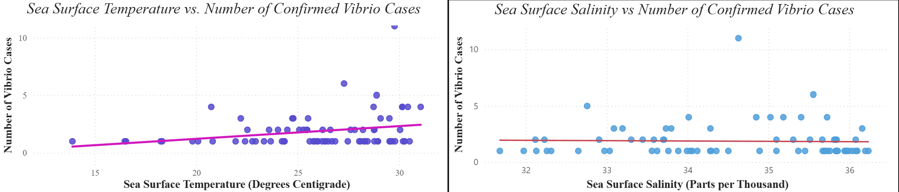

An environmental and infectious-disease analysis exploring how changing coastal conditions relate to *Vibrio vulnificus* occurrence and future risk.

## Question

**How do changing environmental conditions—particularly sea-surface temperature and salinity—relate to the occurrence, seasonality, and geographic risk of *Vibrio vulnificus* along U.S. coastal regions?**

The project also asked whether those historical relationships could be used to characterize future risk. That meant looking beyond simple case counts to connect reported *Vibrio* activity with environmental conditions, seasonal patterns, coastal geography, and time-series behavior.

## Why It Matters

*Vibrio vulnificus* is an environmentally sensitive marine bacterium, which means changes in coastal conditions can alter where and when exposure risk is most likely to occur.

That makes the problem important from both a biological and surveillance perspective. If temperature, salinity, season, and geography are associated with changes in reported *Vibrio* activity, then those patterns can help identify when coastal environments are becoming more favorable for the organism and where risk may be shifting.

Understanding those relationships also matters because environmental conditions are not static. Tracking how *Vibrio* activity changes alongside coastal temperature and salinity can provide a way to study how infectious-disease risk may respond to longer-term environmental change rather than treating historical case patterns as fixed.

## Data

The project combined infectious-disease surveillance data with long-term environmental data from three major sources:

- **CDC surveillance data** — reported *Vibrio vulnificus* incidence across U.S. coastal regions.
- **NOAA sea-surface temperature data** — long-term coastal temperature measurements used to examine how warmer water conditions relate to *Vibrio* activity.
- **NASA salinity data** — environmental salinity measurements used to evaluate whether changes in coastal salinity were associated with reported disease patterns.

Because these datasets were collected for different purposes, they did not initially line up cleanly. I cleaned, standardized, and validated the source data, then harmonized them across geographic and temporal dimensions to create a unified analysis-ready dataset.

The integrated dataset included reported *Vibrio* activity, sea-surface temperature, salinity, seasonality, coastal geography, and derived temporal and environmental features that could be used for exploratory analysis and forecasting.

## Methods

The analysis was completed in four stages:

1. **Integrated and harmonized the source datasets**  
   CDC surveillance records, NOAA sea-surface temperature data, and NASA salinity measurements differed in temporal resolution, geographic structure, missingness, and variable definitions. I cleaned and aligned the datasets so environmental conditions could be compared with reported *Vibrio vulnificus* activity across common spatial and temporal units.

2. **Engineered environmental and temporal features**  
   I created features representing seasonality, environmental conditions, geography, and lagged behavior so the analysis could capture both immediate relationships and patterns that developed over time.

3. **Explored environmental and disease patterns**  
   Exploratory, correlational, and time-series analyses were used to examine:
   - seasonal variation in reported *Vibrio* activity;
   - regional differences across coastal areas;
   - relationships with sea-surface temperature and salinity; and
   - longer-term changes in disease and environmental patterns.

4. **Built and evaluated forecasting models**  
   I compared multiple time-series and machine-learning forecasting approaches using a holdout period and error metrics rather than evaluating model performance on the same observations used for training. Model selection considered predictive performance, error patterns, and how well each approach captured the seasonal structure of the data.

The final outputs were brought into **Power BI** to visualize historical patterns, environmental indicators, geographic variation, and projected *Vibrio* activity in an interactive format.

## Results

The analysis identified several consistent patterns across the environmental, geographic, and forecasting components of the project.

- **Sea-surface temperature showed the strongest environmental relationship with *Vibrio vulnificus* activity.** Warmer coastal conditions were associated with increased reported activity.
- **Salinity showed a weaker inverse relationship.** Lower salinity tended to align with greater *Vibrio* activity, but the relationship was less pronounced than the temperature signal.
- **Strong seasonal patterns were present.** Reported *Vibrio* activity followed recurring seasonal changes rather than remaining constant throughout the year.
- **Risk varied geographically.** Coastal regions did not show identical patterns, reinforcing the importance of considering location alongside environmental conditions.
- **Forecasting suggested continued seasonal variation with a gradual upward trend.** Among the forecasting approaches evaluated—SARIMAX, Random Forest, XGBoost, and Prophet—**SARIMAX produced the strongest overall forecast** because it captured both seasonal structure and environmental trends. 

### Environmental Relationships

{fig-alt="Scatterplots comparing sea-surface temperature and sea-surface salinity with reported Vibrio vulnificus cases. Temperature shows a clearer positive relationship, while salinity shows a much weaker relationship."}

Sea-surface temperature showed a clearer positive relationship with reported *Vibrio vulnificus* activity, while the relationship with salinity was considerably weaker.

### Forecasted *Vibrio vulnificus* Cases

{width="80%" fig-alt="Forecasted Vibrio vulnificus isolates from 2024 through 2028 showing seasonal variation and an overall upward trend"}

The forecast shows short-term variation while maintaining a gradual upward trend in projected *Vibrio* cases through 2028.
## Interpretation

The results suggest that *Vibrio vulnificus* risk is associated with a combination of environmental conditions, seasonality, and geography rather than with time alone.

Sea-surface temperature emerged as the clearest environmental signal. Warmer coastal waters were associated with greater reported *Vibrio* activity, while salinity appeared to provide additional—but weaker—information about when conditions may be favorable.

The strong seasonal structure is also important. Risk does not increase smoothly throughout the year; instead, recurring environmental cycles create periods when conditions are more favorable for *Vibrio*. That helps explain why a time-series model such as SARIMAX performed well: it could represent both the repeating seasonal pattern and longer-term changes in the data.

The geographic variation suggests that environmental change may not affect every coastline in the same way. Local temperature, salinity, seasonality, and historical disease patterns were all associated with differences in how risk appeared across regions.

Taken together, the analysis supports using environmental surveillance alongside disease surveillance. Rather than waiting for reported cases alone to indicate changing risk, environmental patterns may help identify when and where conditions are becoming increasingly favorable for *Vibrio vulnificus*.

## Limitations

Several factors limit how strongly these results can be interpreted.

- **The project is observational.** Associations between sea-surface temperature, salinity, and reported *Vibrio vulnificus* activity do not demonstrate that any single environmental variable caused changes in disease occurrence.

- **The datasets operate at different spatial scales.** NOAA temperature and NASA salinity measurements are gridded environmental observations, while CDC surveillance data describe reported disease activity. Connecting those sources required geographic aggregation and alignment, so the environmental value assigned to a region may not represent the exact conditions experienced by an individual case.

- **The overlapping analysis period was limited by surveillance availability.** Although the NOAA temperature dataset extended back to 1990 and the NASA salinity dataset to 2011, the temperature data were ultimately filtered to 2018 onward to align with the available BEAM surveillance period. 

- **Environmental datasets contained missing observations and measurement uncertainty.** Missing SST and salinity values were removed during preprocessing, and the NASA salinity product itself includes formal and empirical uncertainty measures.  

- **Forecasts depend on historical patterns continuing into the future.** SARIMAX and the other forecasting models can represent seasonality and trends present in the observed data, but unusual environmental events, changes in surveillance practices, or shifts in human exposure could produce future patterns that the historical data do not capture.

For those reasons, the forecasts should be interpreted as **model-based projections of future patterns rather than predictions of exact future case counts**.

## Next Steps

The project could be extended in several ways to make the environmental risk analysis more biologically informative and more useful for forecasting.

- **Add additional environmental variables.** Factors such as chlorophyll concentration, precipitation, river discharge, dissolved oxygen, and coastal nutrient conditions could help explain variation that temperature and salinity alone do not capture.

- **Improve spatial resolution.** Instead of aggregating environmental conditions broadly by region or state, future work could model risk at finer coastal locations and examine how local environmental conditions correspond with reported *Vibrio* activity.

- **Model environmental thresholds and interactions.** Rather than treating temperature and salinity as independent predictors, future analyses could test whether certain combinations of warm water and favorable salinity create nonlinear increases in risk.

- **Use climate projections instead of extending historical trends alone.** Future forecasts could incorporate projected sea-surface temperature and salinity under climate scenarios, allowing the analysis to estimate how suitable *Vibrio* conditions may shift geographically over longer time horizons.

- **Separate environmental suitability from human disease risk.** A stronger future model could distinguish between conditions favorable for *Vibrio* growth and the human behaviors that determine exposure, such as seafood consumption or recreational water contact.

Ultimately, the next step would be to move from forecasting reported *Vibrio* activity toward an **environmental suitability model that estimates where and when coastal conditions become favorable for *Vibrio vulnificus*.**

## Repository

The full project repository includes the exploratory analysis, geospatial analysis, forecasting notebooks, preprocessing documentation, Power BI dashboard, final report, and presentation materials.

[View the Vibrio vulnificus Risk Analysis repository →](https://github.com/AnkurBambhrolia/Vibrio)